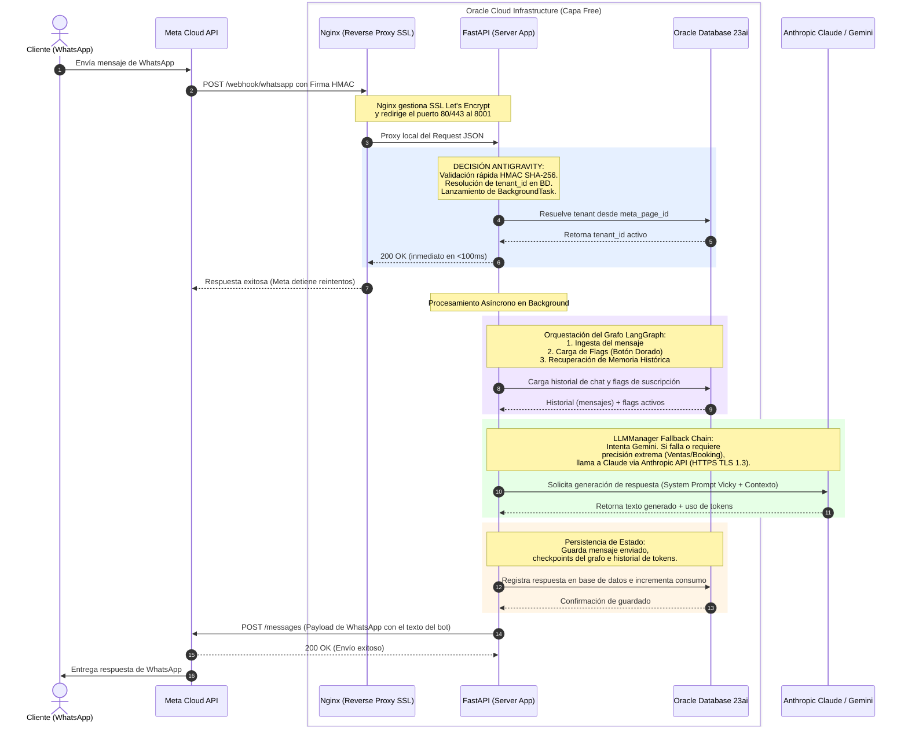

# ValVic — Portafolio de Gestión & Arquitectura de Software

> **Visión Ejecutiva y Técnica del Core de Automatización Conversacional para Pymes y Clínicas.**  
> *Constitución de Producto y Arquitectura de Alta Disponibilidad — Versión Pública v2 (Mayo 2026).*

---

## 1. Descripción del Producto

**ValVic** es un ecosistema SaaS multi-tenant de automatización conversacional y CRM diseñado específicamente para Pymes y Clínicas de Servicios (como clínicas veterinarias, consultorios médicos, y agencias de servicios) en Chile. 

El producto resuelve el problema crítico de la **pérdida de oportunidades comerciales y eficiencia operativa** debido a llamadas no contestadas o chats de WhatsApp desatendidos durante consultas o fuera del horario laboral.

### Propuesta de Valor:
* **Agente de Citas Inteligente 24/7 ("Vicky"):** Permite que los dueños de mascotas o pacientes agenden citas de forma autónoma a través de WhatsApp e Instagram, simulando un flujo conversacional humano adaptado al tono del negocio.
* **Confirmación y Recordatorios Automatizados:** Reduce la tasa de inasistencia (no-show) mediante notificaciones predictivas enlazadas a la agenda.
* **CRM Interno Unificado (Next.js 15):** Permite a los operadores humanos supervisar las conversaciones, intervenir en tiempo real (co-pilotaje) y gestionar el pipeline de ventas a través del "Botón Dorado" (habilitación instantánea de módulos de prospección, ventas y reservas).
* **Integraciones y Atribución:** Captura automáticamente leads desde Google Maps y web scraping local, y permite despachar eventos operacionales hacia webhooks externos del cliente.

---

## 2. Decisiones de Arquitectura (Patrón Antigravity)

Para garantizar la máxima velocidad de respuesta, un bajo costo operativo y un desacoplamiento absoluto de los módulos del sistema, implementamos el **Patrón Antigravity** de desarrollo ágil:

```
[Cliente WhatsApp] ──(Payload JSON)──> [Meta Cloud API] ──(JSON)──> [Nginx / FastAPI]
                                                                        │
                                                         (Desacoplamiento asíncrono)
                                                                        ▼
                                                         [LangGraph / CrewAI Agent]
```

* **Desacoplamiento Extremo mediante FastAPI BackgroundTasks:**  
  La API de Meta exige una respuesta HTTP `200 OK` en menos de 3 segundos para evitar reintentos infinitos que saturen el servidor. Nuestra API en FastAPI recibe el payload JSON ligero de Meta, valida la firma, y delega inmediatamente el procesamiento a tareas en segundo plano (`BackgroundTasks`), liberando el socket y respondiendo en milisegundos.
* **Alta Cohesión en Módulos de Prompts y Webhooks:**  
  Los prompts de negociación y prospección se encuentran aislados de la lógica de programación (en [ventas.py](file:///d:/Usuarios/V%C3%ADctor/Documentos/ValVic/backend/prompts/ventas.py)), lo que permite ajustar la personalidad, precios y la "escalera de concesiones" sin tocar una sola línea de código ejecutable. Asimismo, las firmas criptográficas de Meta se verifican en la frontera del enrutador (`webhooks.py`), impidiendo llamadas no autorizadas al motor de IA.
* **Consumo de APIs Propias Mediante Payloads Ligeros:**  
  Los módulos internos del CRM de Next.js 15 consumen endpoints estructurados basados en esquemas Pydantic v2 muy estrictos. Esto mantiene la transferencia de red ligera, rápida y fácil de auditar, protegiendo los datos confidenciales de los tenants mediante aislamiento estricto por `tenant_id` a nivel de base de datos relacional.

---

## 3. Ciclo de Vida del Desarrollo (SDLC)

El desarrollo del núcleo conversacional de ValVic se optimizó exponencialmente mediante el uso estructurado de **Cursor** y metodologías ágiles de orquestación de LLMs, logrando un **time-to-market inferior a 5 días** para módulos clave de negocio.

### Flujo de Trabajo con Cursor:
1. **Modelado y SPARC (Especificación, Tools, Schemas, Errores y Testing):**  
   Antes de escribir código, definimos los contratos Pydantic y las herramientas accesibles por la IA. Cursor procesa estos contextos para generar esqueletos de código altamente tipados y funcionales.
2. **Generación y Refactorización Contextual:**  
   Utilizamos la capacidad de indexación de Cursor sobre el codebase local para asegurar la consistencia del multi-tenant y la integridad relacional de la base de datos sin introducir deuda técnica.
3. **Iteración en Caliente:**  
   El desacoplamiento de la base de datos (permitiendo SQLite local y Oracle 23ai en producción) nos permite simular flujos conversacionales mediante scripts de consola locales antes de exponer puertos a la API de Meta, reduciendo el ciclo de feedback de minutos a segundos.

---

## 4. Ecosistema Cloud (OCI Always Free + Claude)

ValVic aprovecha al máximo la ingeniería de costos eficientes mediante la infraestructura siempre gratuita de Oracle Cloud y una orquestación resiliente de modelos de lenguaje avanzados.

* **Arquitectura $0 Servidor (OCI Ampere A1 Compute):**  
  Toda la API backend de FastAPI y el proxy reverso Nginx se ejecutan sobre una instancia virtual ARM Ampere de Oracle Cloud Infrastructure (OCI) con 4 OCPUs y 24 GB de RAM en la capa **Always Free**. Esto reduce a cero el costo operativo de los servidores en producción.
* **Base de Datos de Siguiente Generación:**  
  Utilizamos **Oracle Database 23ai Free Tier** para la persistencia relacional multitenant y el almacenamiento de vectores de contexto clínico (AI Vector Search), unificando la base relacional del CRM y la memoria de largo plazo de los agentes en un único motor de alto rendimiento.
* **Orquestación Segura y Failover Híbrido (Gemini & Claude):**  
  La arquitectura de IA implementa un gestor de LLM multi-proveedor (`LLMManager`) que utiliza **Gemini 2.5 (Flash/Pro)** como motor principal por su baja latencia y excelente ventana de contexto, con un failover automático hacia **Anthropic Claude (Sonnet/Haiku)** mediante conexiones HTTP TLS 1.3 seguras. Si el proveedor primario falla, la transacción conversacional se redirige automáticamente al respaldo sin caída del servicio, registrando detalladamente el uso de tokens y latencias.

---

## 5. Diagrama de Secuencia de Datos (End-to-End)

El siguiente diagrama detalla cómo fluyen los datos y las decisiones de diseño arquitectónico desde el dispositivo del cliente hasta los proveedores de IA y la base de datos en OCI:



---

## Ecosistema Documental Interno

Para una visión técnica más profunda del monorepo y la infraestructura privada de ValVic, consulte los siguientes documentos de ingeniería en la sección `/documentacion/`:

1. [Contrato API & Webhooks (api_contract.md)](documentacion/api_contract.md): Especificación técnica en formato OpenAPI YAML de los endpoints de negocio y automatización.
2. [Ecosistema de Red e Infraestructura (system_architecture.md)](documentacion/system_architecture.md): Mapa detallado del aprovisionamiento en Oracle Cloud, políticas de seguridad perimetral, almacenamiento de datos y orquestación multi-tenant.
