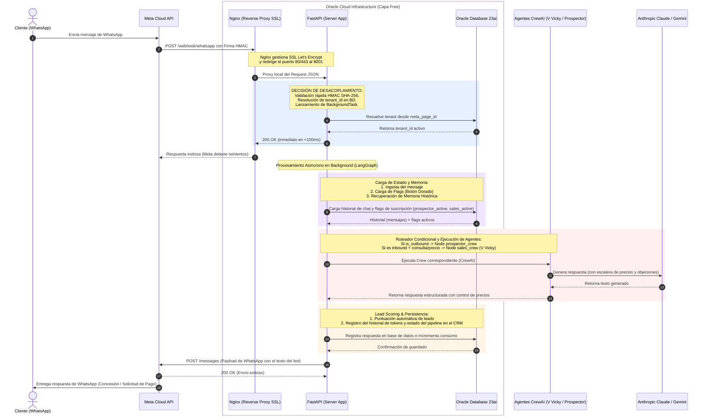

# ValVic — Portafolio de Gestión & Arquitectura de Software

> **Visión Ejecutiva y Técnica del Core de Automatización Conversacional para Pymes y Clínicas.**  
> *Constitución de Producto y Arquitectura de Alta Disponibilidad — Versión Pública v2 (Mayo 2026).*

---

## 1. Descripción del Producto

**ValVic** es un ecosistema SaaS multi-tenant de automatización conversacional y CRM diseñado específicamente para Pymes y Clínicas de Servicios (como clínicas veterinarias, consultorios médicos, y agencias de servicios) en Chile. 

El producto resuelve la **pérdida de oportunidades comerciales y la ineficiencia operativa** mediante un embudo automático de adquisición y conversión B2B basado en agentes de inteligencia artificial y orquestación avanzada.

### Ecosistema de Agentes Core:
* **Agente Prospector B2B (Outbound):** Captura de forma proactiva leads de negocios locales, audita su presencia digital y redacta mensajes de apertura hiper-personalizados para iniciar campañas de prospección en frío.
* **Agente Vendedor ("Vicky" - Inbound):** Atiende consultas, maneja objeciones típicas de la industria, aplica una estrategia de precios y negociación estructurada, y realiza el cierre de ventas guiando al prospecto hasta la señal de pago.
* **CRM Multitenant Integrado (Next.js 15):** Permite a los operadores humanos monitorear las interacciones de los agentes, tomar control de los chats en tiempo real (co-pilotaje) y configurar los módulos de automatización a través de flags globales ("Botón Dorado").

---

## 2. Decisiones de Arquitectura (Patrón de Desacoplamiento Asíncrono)

Para garantizar la máxima velocidad de respuesta, un bajo costo operativo y un desacoplamiento absoluto de los módulos del sistema, implementamos un **Patrón de Desacoplamiento Asíncrono (Fire-and-Forget)**:

```
[Cliente WhatsApp] ──(Payload JSON)──> [Meta Cloud API] ──(JSON)──> [Nginx / FastAPI]
                                                                        │
                                                         (Desacoplamiento asíncrono)
                                                                        ▼
                                                         [LangGraph / CrewAI Agent]
```

* **Desacoplamiento Extremo mediante FastAPI BackgroundTasks:**  
  La API de Meta exige una respuesta HTTP `200 OK` en menos de 3 segundos para evitar reintentos infinitos que saturen el servidor. Nuestra API en FastAPI recibe el payload JSON ligero de Meta, valida la firma, y delega inmediatamente el procesamiento a tareas en segundo plano (`BackgroundTasks`), liberando el socket y respondiendo en milisegundos.
* **Alta Cohesión en Módulos de Prompts y Webhooks:**  
  Los prompts de negociación y prospección se encuentran aislados de la lógica de programación (en [ventas.py](file:///d:/Usuarios/V%C3%ADctor/Documentos/ValVic/backend/prompts/ventas.py)), lo que permite ajustar la personalidad, precios y la "escalera de concesiones" sin tocar una sola línea de código ejecutable. Asimismo, las firmas criptográficas de Meta se verifican en la frontera del enrutador (`webhooks.py`), impidiendo llamadas no autorizadas al motor de IA.
* **Consumo de APIs Propias Mediante Payloads Ligeros:**  
  Los módulos internos del CRM de Next.js 15 consumen endpoints estructurados basados en esquemas Pydantic v2 muy estrictos. Esto mantiene la transferencia de red ligera, rápida y fácil de auditar, protegiendo los datos confidenciales de los tenants mediante aislamiento estricto por `tenant_id` a nivel de base de datos relacional.

---

## 3. Ecosistema de Agentes B2B y Embudo de Captación (CrewAI & LangGraph)

El valor estratégico de ValVic radica en su capacidad de automatizar el ciclo comercial completo: desde la captación en frío hasta el cierre del pago y registro en el CRM.

### A. Captación Fría (Agente Prospector)
Ubicado en [prospector.py](file:///d:/Usuarios/V%C3%ADctor/Documentos/ValVic/backend/scripts/prospector.py) y orquestado de manera multi-vertical (veterinarias, estética, dental, etc.), este agente realiza las siguientes fases en segundo plano:
1. **Lead Sourcing Automático (Google Places API v1):** Realiza búsquedas geo-localizadas en Chile obteniendo el nombre del negocio, dirección, valoración (estrellas), cantidad de reseñas, sitio web y teléfono nacional en un único request de red. Si no se provee API Key, implementa un fallback generador con Claude Haiku.
2. **Auditoría Web y Calificación Inteligente:** Evalúa el nivel de digitalización del prospecto (`sin_web`, `web_basica`, `web_buena`) y su volumen de reseñas en Google Maps para asignarle una puntuación de idoneidad comercial (escala de 1 a 10).
3. **Copywriting Conversacional B2B:** Si el prospecto califica con puntaje $\ge 5$, el agente redacta un mensaje de apertura por WhatsApp enfocado en el dolor típico del rubro (ej. llamadas perdidas durante consultas en veterinarias) terminando con una pregunta cerrada (sí/no), evitando sonar corporativo.
4. **Modos de Envío Flexibles:**
   * **Modo Meta API:** Envío automático masivo usando plantillas homologadas por WhatsApp Business.
   * **Modo Click-to-Chat (wa.me):** Genera enlaces directos de WhatsApp pre-rellenados. A través de la CLI `python prospector.py --solo-revisar`, un operador humano puede auditar el mensaje generado, hacer clic y abrir la conversación directamente en su WhatsApp Web en un segundo, protegiendo costos y mitigando bloqueos.

### B. Conversión, Negociación y Cierre de Pago (Agente Vendedor - Vicky)
Ubicado en [vendedor.py](file:///d:/Usuarios/V%C3%ADctor/Documentos/ValVic/backend/api/crews/vendedor.py) e inyectado con prompts avanzados de [ventas.py](file:///d:/Usuarios/V%C3%ADctor/Documentos/ValVic/backend/prompts/ventas.py), Vicky actúa cuando el prospecto responde por WhatsApp:
1. **Ruteo Condicional en LangGraph (`route_after_guard`):** Si el intent clasificado no es peligroso y el flag del tenant `sales_active` está activado, la conversación se delega inmediatamente al nodo de `sales_crew`.
2. **Escalera de Concesiones:** Para proteger el margen de ganancia de ValVic, el agente maneja las objeciones de precio de forma secuencial y restrictiva, sin revelar nunca su lógica interna:
   * *Techo (Precios de Lista):* Ofrece el precio configurado del servicio como punto de partida.
   * *Concesión 1 (Descuento en Onboarding):* Rebaja leve porcentual en la implementación ante la primera objeción.
   * *Concesión 2 (Flujo de Caja):* División del pago en hitos (mitad al inicio, mitad al entregar el sistema).
   * *Concesión 3 (Descuento temporal):* Reducción en la mensualidad durante los primeros meses.
   * *Piso Absoluto:* Existe un piso de precio pre-configurado infranqueable. Si el prospecto presiona por debajo de dicho piso, Vicky detiene la negociación autónoma y escala la conversación a un ejecutivo humano para proteger el LTV (Life-Time Value).
3. **Cierre hasta la Señal de Pago:** Al concretarse el interés por un servicio, Vicky empuja activamente a la conversión solicitando el abono inicial: *"Para reservar la fecha de implementación, requerimos una señal de inicio — ¿prefieres transferencia o link de pago?"*.
4. **CRM Sync:** Al finalizar el flujo, se actualiza el pipeline en base de datos registrando el scoring del lead, el estado de la oportunidad y el historial de tokens consumidos.

---

## 4. Ciclo de Vida del Desarrollo (SDLC)

El desarrollo del núcleo conversacional de ValVic se optimizó exponencialmente mediante el uso estructurado de **Cursor** y metodologías ágiles de orquestación de LLMs, logrando un **time-to-market inferior a 5 días** para módulos clave de negocio.

### Flujo de Trabajo con Cursor:
1. **Modelado y SPARC (Especificación, Tools, Schemas, Errores y Testing):**  
   Antes de escribir código, definimos los contratos Pydantic y las herramientas accesibles por la IA. Cursor procesa estos contextos para generar esqueletos de código altamente tipados y funcionales.
2. **Generación y Refactorización Contextual:**  
   Utilizamos la capacidad de indexación de Cursor sobre el codebase local para asegurar la consistencia del multi-tenant y la integridad relacional de la base de datos sin introducir deuda técnica.
3. **Iteración en Caliente:**  
   El desacoplamiento de la base de datos (permitiendo SQLite local y Oracle 23ai en producción) nos permite simular flujos conversacionales mediante scripts de consola locales antes de exponer puertos a la API de Meta, reduciendo el ciclo de feedback de minutos a segundos.

---

## 5. Ecosistema Cloud (OCI Always Free + Claude)

ValVic aprovecha al máximo la ingeniería de costos eficientes mediante la infraestructura siempre gratuita de Oracle Cloud y una orquestación resiliente de modelos de lenguaje avanzados.

* **Arquitectura $0 Servidor (OCI Ampere A1 Compute):**  
  Toda la API backend de FastAPI y el proxy reverso Nginx se ejecutan sobre una instancia virtual ARM Ampere de Oracle Cloud Infrastructure (OCI) con 4 OCPUs y 24 GB de RAM en la capa **Always Free**. Esto reduce a cero el costo operativo de los servidores en producción.
* **Base de Datos de Siguiente Generación:**  
  Utilizamos **Oracle Database 23ai Free Tier** para la persistencia relacional multitenant y el almacenamiento de vectores de contexto clínico (AI Vector Search), unificando la base relacional del CRM y la memoria de largo plazo de los agentes en un único motor de alto rendimiento.
* **Orquestación Segura y Failover Híbrido (Gemini & Claude):**  
  La arquitectura de IA implementa un gestor de LLM multi-proveedor (`LLMManager`) que utiliza **Gemini 2.5 (Flash/Pro)** como motor principal por su baja latencia y excelente ventana de contexto, con un failover automático hacia **Anthropic Claude (Sonnet/Haiku)** mediante conexiones HTTP TLS 1.3 seguras. Si el proveedor primario falla, la transacción conversacional se redirige automáticamente al respaldo sin caída del servicio, registrando detalladamente el uso de tokens y latencias.

---

## 6. Diagrama de Secuencia de Datos (End-to-End)

El siguiente diagrama detalla cómo fluyen los datos y las decisiones de diseño arquitectónico desde el dispositivo del cliente hasta los proveedores de IA y la base de datos en OCI:



---

## Ecosistema Documental Interno

Para una visión técnica más profunda del monorepo y la infraestructura privada de ValVic, consulte los siguientes documentos de ingeniería en la sección `/documentacion/`:

1. [Contrato API & Webhooks (api_contract.md)](documentacion/api_contract.md): Especificación técnica en formato OpenAPI YAML de los endpoints de negocio y automatización.
2. [Ecosistema de Red e Infraestructura (system_architecture.md)](documentacion/system_architecture.md): Mapa detallado del aprovisionamiento en Oracle Cloud, políticas de seguridad perimetral, almacenamiento de datos y orquestación multi-tenant.
